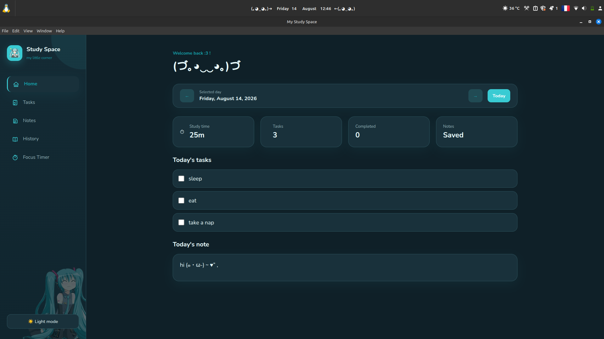
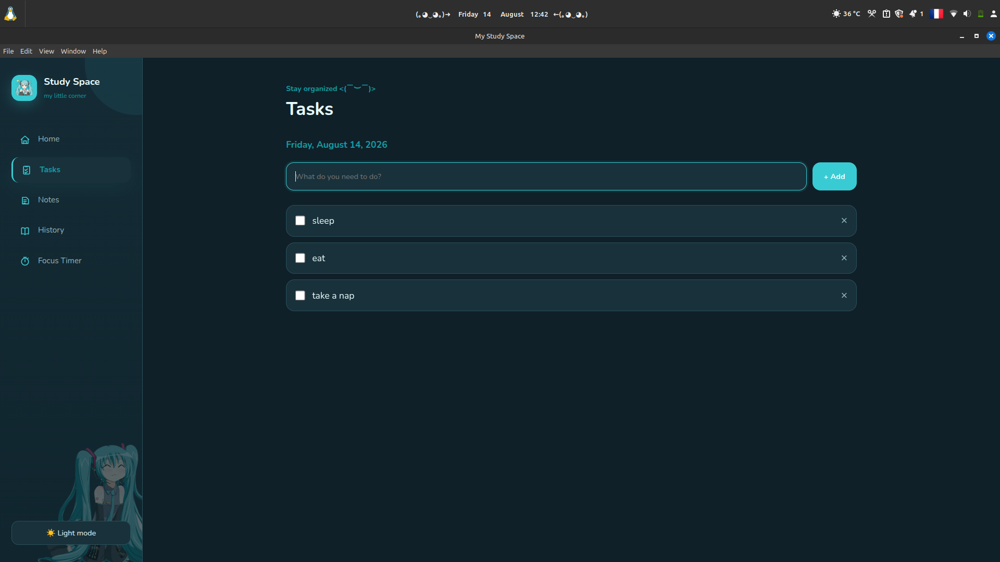
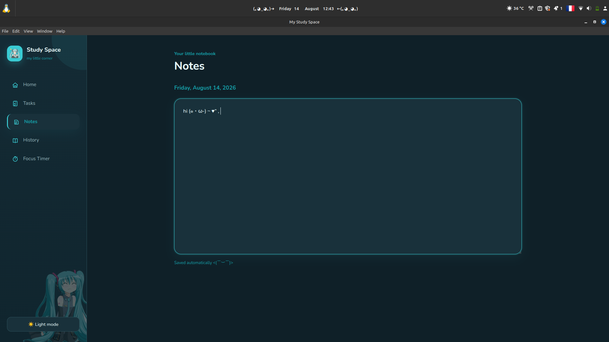
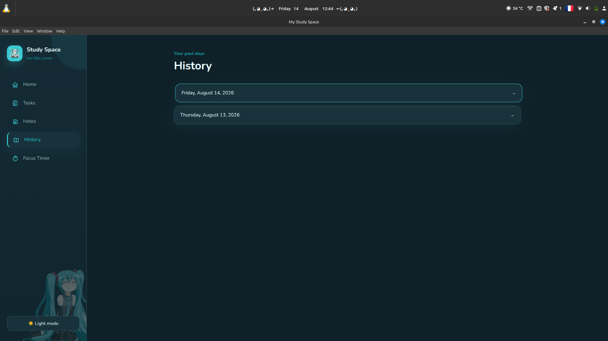
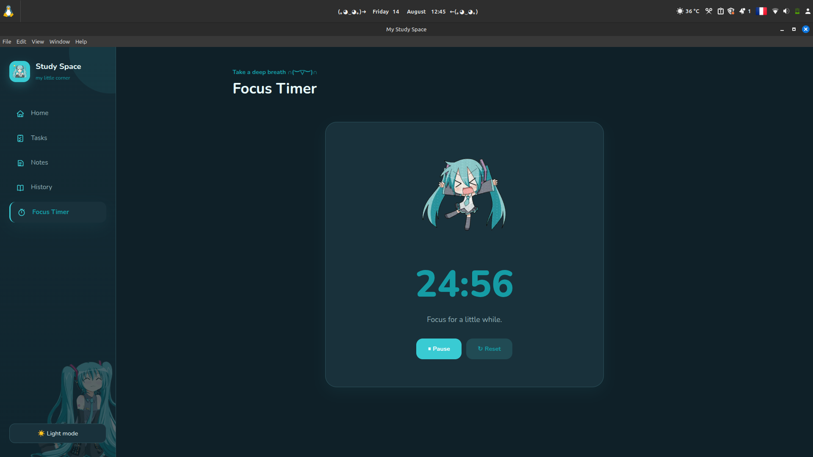

# 39space

A minimal desktop app for daily notes, tasks, and focus sessions built with Electron.

   

## Features

- **Home** — daily overview: study time, task count, completed tasks, today's note

  

- **Tasks** — add, complete, and delete tasks per day

  

- **Notes** — autosaving notes per day

  

- **History** — browse past days that have notes, tasks, or study time

  

- **Focus Timer** — 25-minute focus sessions that log study time automatically
  
  

- Light/dark mode

## Tech stack

- [Electron](https://www.electronjs.org/)
- [better-sqlite3](https://github.com/WiseLibs/better-sqlite3) for local storage
- Vanilla HTML/CSS/JS 
## Getting started

```bash
git clone https://github.com/YOUR-USERNAME/39space.git
cd 39space
npm install
npm start
```

## Building an AppImage (Linux)

```bash
npm run dist
```

The AppImage will be generated in `dist/`.

## Data storage

All data (notes, tasks, study time) is stored locally in a SQLite database under your OS's user data folder

## License

MIT 
